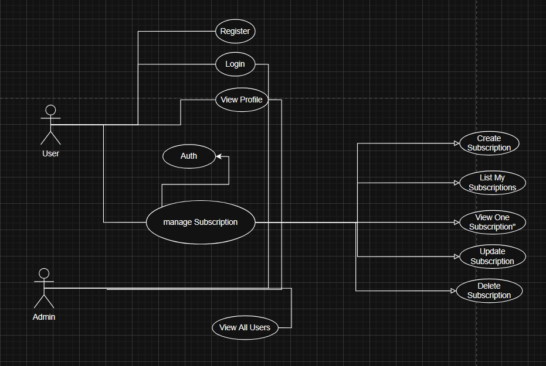
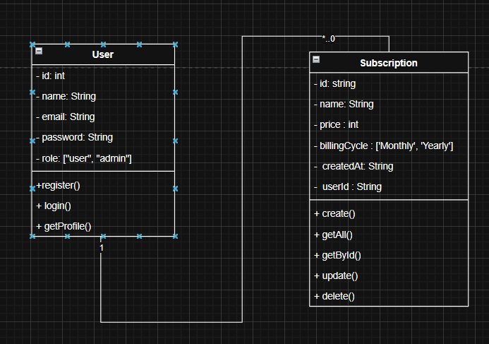

# SubLedger API

SubLedger is a secure backend API that allows users to manage their digital subscriptions.

The system includes authentication, protected routes, role-based authorization, and subscription management using **Node.js, Express, and MongoDB**.

---

## Technologies Used

- Node.js
- Express.js
- MongoDB
- Mongoose
- JWT (jsonwebtoken)
- bcrypt
- Joi (validation)
- dotenv

---

## Features

### Authentication
- User registration
- User login
- JWT token authentication
- Protected routes

### Authorization
- Role-based access (User / Admin)

### Subscription Management
Users can manage their subscriptions:

- Create subscription
- List subscriptions
- View subscription
- Update subscription
- Delete subscription

### Admin Features
Admins can access administrative routes such as:

- View all users

---

## Database Design

The project uses MongoDB with two main collections.

### User

Fields:

- id
- name
- email
- password
- role
- createdAt

### Subscription

Fields:

- id
- name
- price
- billingCycle (monthly | yearly)
- createdAt
- userId (reference to User)

### Relationship


One user can have multiple subscriptions.

---

## API Routes

### Auth Routes

| Method | Route | Description |
|------|------|------|
| POST | /auth/register | Register new user |
| POST | /auth/login | Login user |
| GET | /profile | Get logged user profile |

---

### Subscription Routes (Protected)

| Method | Route | Description |
|------|------|------|
| POST | /subscriptions | Create subscription |
| GET | /subscriptions | Get user subscriptions |
| GET | /subscriptions/:id | Get single subscription |
| PUT | /subscriptions/:id | Update subscription |
| DELETE | /subscriptions/:id | Delete subscription |

---

### Admin Routes

| Method | Route | Description |
|------|------|------|
| GET | /admin/users | Get all users (Admin only) |

---

## Authentication

The API uses **JWT tokens** for authentication.

Example request header: Authorization: Bearer TOKEN


---

## Project Structure

subledger-api
│
├── package.json
├── .env
├── .gitignore
├── README.md
│
└── src
    │
    ├── index.js
    ├── server.js
    │
    ├── config
    │   └── db.js
    │
    ├── models
    │   ├── User.js
    │   └── Subscription.js
    │
    ├── routes
    │   ├── auth.routes.js
    │   ├── subscription.routes.js
    │   └── admin.routes.js
    │
    ├── controllers
    │   ├── auth.controller.js
    │   ├── subscription.controller.js
    │   └── admin.controller.js
    │
    ├── services
    │   ├── auth.service.js
    │   └── subscription.service.js
    │   └── admin.service.js
    │
    ├── middlewares
    │   ├── auth.middleware.js
    │   ├── role.middleware.js
    │   ├── validators.js
    │   ├── validateRequest.js
    │   ├── errorHandler.js
    │   └── notFound.js
    │
    └── utils
        ├── generateToken.js
        └── response.js
        └── seedAdmin.js


---

## Installation

Clone the repository:

```bash
 git clone https://github.com/Mouad-MCH/SubLedger-API.git
```

Install dependencies:

```bash
 npm install
```

---

## Environment Variables

Create a `.env` file in the root directory.

Example:
PORT=5000
MONGO_URI=mongodb://127.0.0.1:27017/subledger
JWT_SECRET=your_secret_key


---

## Run the Project

Development mode:

npm run dev


---

## UML Diagrams

The project documentation includes:

- Use Case Diagram
- Class Diagram


# UML Diagrams

## Use Case Diagram



## Class Diagram




---

## Learning Outcomes

Through this project we practiced:

- Building REST APIs with Node.js and Express
- Implementing authentication with JWT
- Password hashing with bcrypt
- Validation using Joi
- MongoDB data modeling
- Role-based access control
- Middleware architecture

---

## Author

SubLedger API  
Backend project for Web Development training.
